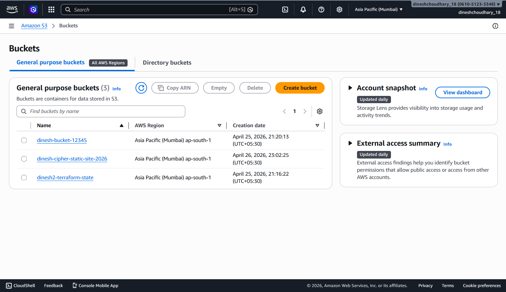
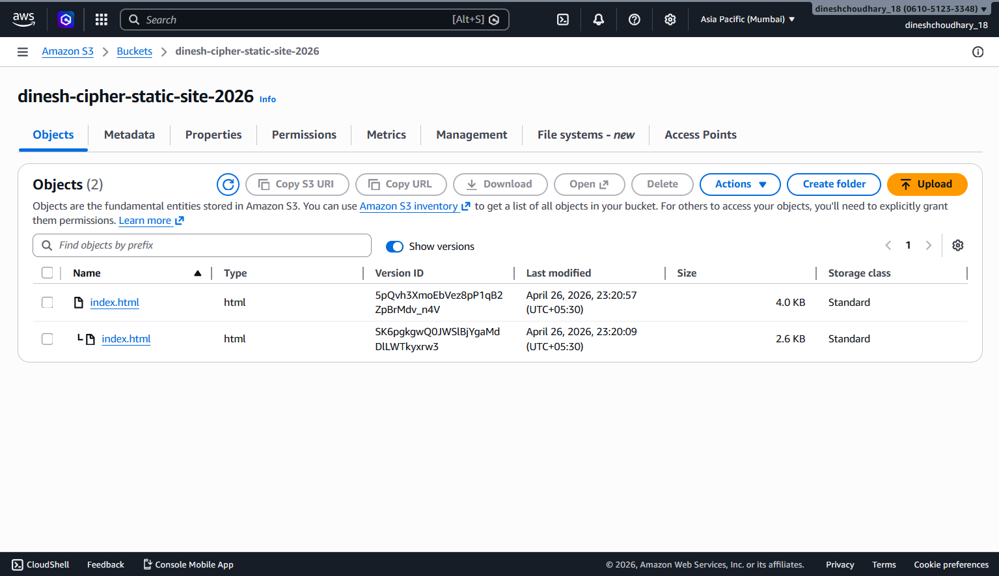
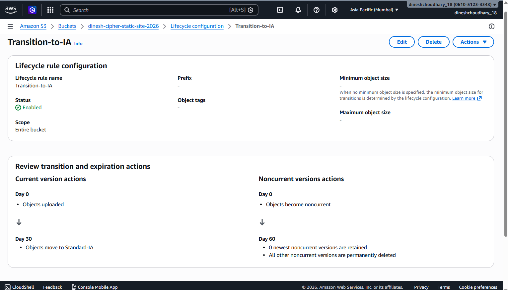
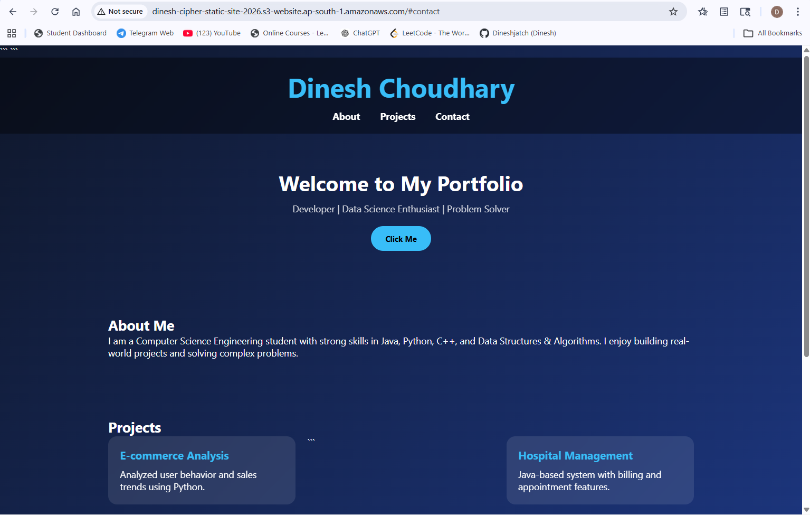

# AWS S3 Static Website Hosting Assignment

## Name:

Dinesh

## Registration Number:

12312648

## Project Description:

This project demonstrates the use of AWS S3 for:

* Object storage
* Static website hosting
* Versioning
* Lifecycle rules for cost optimization

## Deployed Website Link:

http://dinesh-cipher-static-site-2026.s3-website.ap-south-1.amazonaws.com

## Screenshots:

### 1. S3 Bucket

### 2. Versioning

### 3. Lifecycle Rules

### 4. Static Website

## Challenges Faced:

* Configuring bucket policy for public access
* Understanding lifecycle rules
* Managing versioning correctly

## Conclusion:

This assignment helped me understand AWS S3 storage, website hosting, and cost optimization techniques.
